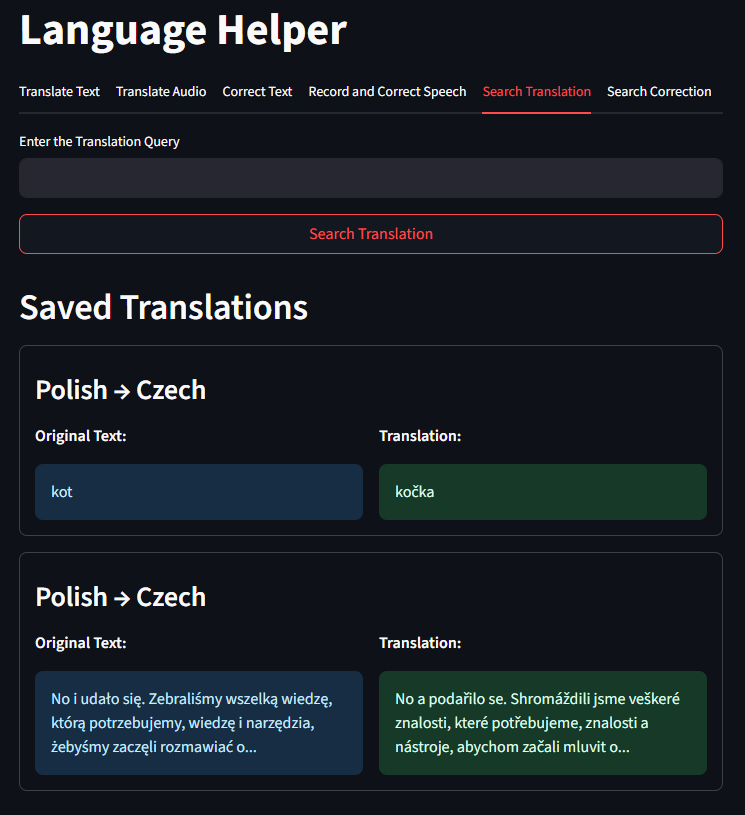
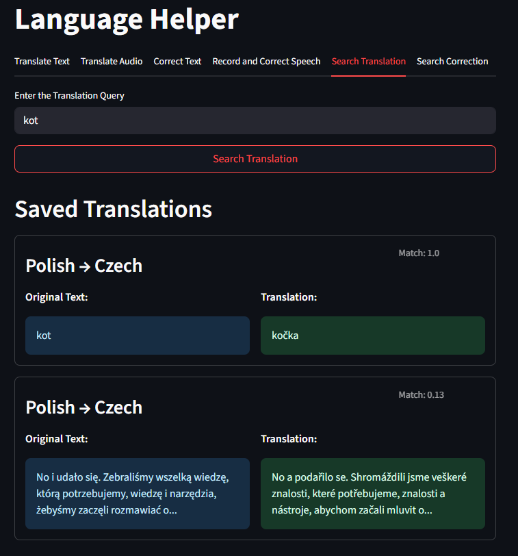
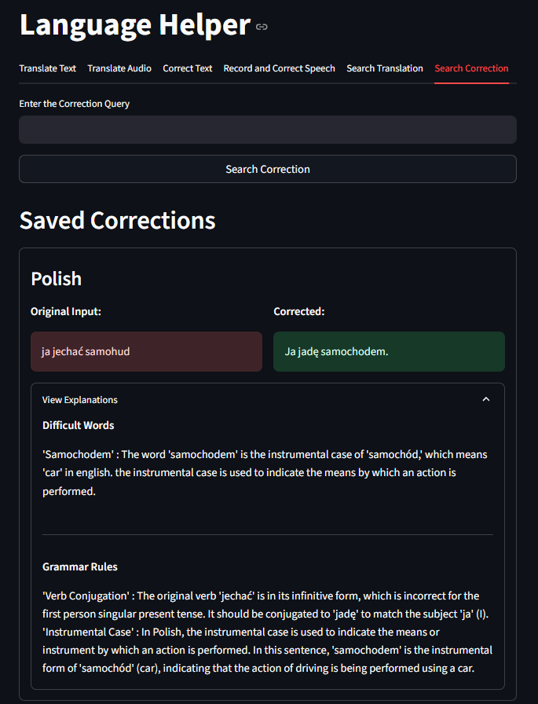
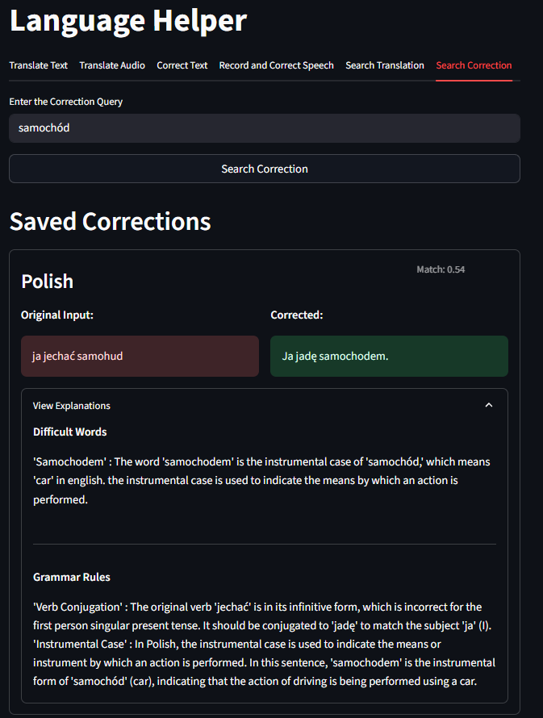

# Language Helper — Translate, Correct, and Search (Text & Audio)

## Project Description

A Streamlit app for language practice: translate text or audio, correct sentences (with explanations and pronunciation), and save everything to a local Qdrant vector store for fast, semantic search. The app uses **OpenAI** for detection, correction, **TTS/STT**, and **Qdrant** for storage and retrieval.

## Features

- Translate Text:
    - Detects input language, speaks the input, translates it, and speaks the translation.
- Translate Audio:
    - Upload audio (`.mp3`, `.wav`), transcribe it, translate it, and listen to the result.
- Correct Text:
    - Checks grammar; if needed, returns a corrected version plus “tricky words” and grammar explanations, with pronunciation audio.
- Record and Correct Speech:
    - Record in-app, transcribe, check and correct, get explanations, and listen to the corrected sentence.
- Save & Search:
    - Save translations and corrections; browse the latest items or run semantic search over saved content.

## Technologies

- `streamlit` - web app
- `pydub` - works with audio files (requires system package: **ffmpeg**)
- `openai` - GPT-4o (reasoning), whisper-1 (STT), tts-1 (TTS), embeddings
- `instructor` + `pydantic` — structured outputs (typed responses for detection/corrections)
- `qdrant-client` - stores and searches translations and corrections
- `pandas` - handling dataframes for search results
- `audiorecorder` — simple mic recording in Streamlit

## Project Structure

- language_helper2
    - images
        - api_key.PNG
        - correct_speech_success.PNG
        - correct_speech.PNG
        - correct_text_success.PNG
        - correct_text.PNG
        - corrections_no_query.PNG
        - corrections_with_query.PNG
        - s_correct_speech.PNG
        - s_correct_text.PNG
        - s_translate_audio.PNG
        - s_translate_text.PNG
        - translate_audio.PNG
        - translate_text.PNG
        - translations_no_query.PNG
        - translations_with_query.PNG
    - app.py
    - packages.txt
    - readme.md
    - requirements.txt

## Running the Application (local)

- Open `app.py` and project's folder in VSCode.
- Open the terminal with *CTRL + Shift + `*.
- Create a Conda environment using Python version 3.11: `conda create -n env_name python=3.11`.
- Add conda-forge channel: `conda config --append channels conda-forge`.
- Activate the Conda environment: `conda activate env_name`.
- Install required packages from the requirements.txt file:
    - `cd path_to_project_folder`
    - `pip install -r packages.txt`
    - `pip install -r requirements.txt`
- Run the app by `streamlit run app.py`.

## How to Use the App

- On first load, enter your OpenAI API key in the input field (stored only in session memory; page refresh clears it).

- Use the tabs along the top.
- **Translate Text**:
    - Pick **Input Language** and **Output Language**. 
    - Enter the input.
    - Click **Translate Text**.
        - The app detects language, plays input TTS, shows translation, and plays output TTS.
    - Click **Save Translation**.

- **Translate Audio**:
    - Choose **Desired Output Language**.
    - Upload an audio file (`.mp3`/`.wav`).
    - Click Translate Audio Content to transcribe (Whisper), translate (GPT-4o), and play TTS.
    - Click **Save Audio Translation** to store transcription + translation.

        
- **Correct Text**:
    - Choose Language and paste a sentence.
    - Click Fix and Explain.
        - If correct, you’ll see a success message.
        - If not, you’ll get:
            - **Correct Form**
            - **Tricky Words Explanation** (definitions in English)
            - **Grammar Explanation** (rules in English)
            - **Pronunciation** (TTS of the correction)
    - Click Save Correction to store results.

- **Record and Correct Speech**
    - Select **Recorded Speech Language**.
    - Record using the in-app **audiorecorder**.
    - Click **Check and Fix** to transcribe, detect language, evaluate grammar, and if needed, get:
        - If correct, you’ll see a success message.
        - Corrected sentence, tricky words, grammar explanations, and TTS of the correction.
    - Click **Save Speech Correction** to store results.

- **Qdrant**
 - **Collections**
    - `translations`: stores input/output text, languages, and four vectors (input language/text, translation language/text).
    - `corrections`: stores original text, corrected text, tricky words, grammar notes, and five vectors (input language/text, correction, words, grammar).
Storage is in-memory (`QdrantClient(':memory:')`), so data resets on app restart.

**Search Translation / Search Correction**
- Enter a query and click **Search** to run **semantic search** over saved items.
- Leave the query blank to see the 10 most recent entries.
This allows the app to return translations or corrections that are most semantically similar to your query, even if the exact words differ (**Cosine Similarity**).

**Notes on Secrets & Keys**
- **OpenAI API Key**: entered in the app UI and held in `st.session_state` only.

**Requirements**
- pacgages.txt:
    - `ffmpeg`
- requirements.txt:
    - streamlit
    - openai
    - instructor
    - pydantic
    - pydub
    - qdrant-client
    - audiorecorder
    - pandas